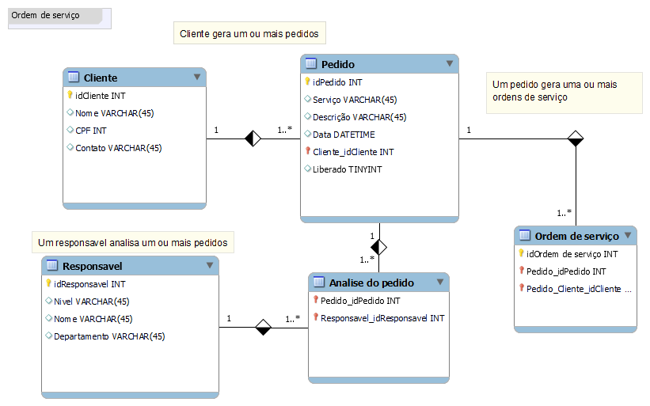
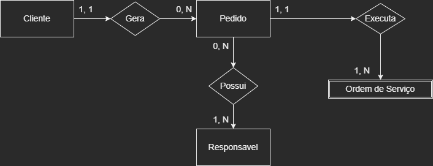

# 💻 Contexto
Dentro de uma empresa os clientes demandam ao helpdesk algumas açôes.
Essas ações sao convertidas em serviços.

## 📔 Entidades & Relacionamentos
- [x] Entidades
- Cliente
- Pedido
- Responsavel
- Ordem de serviço
- [x] Relacionamentos
- Solicita
- Analisa
- Executa
- Arquiva

  
  

